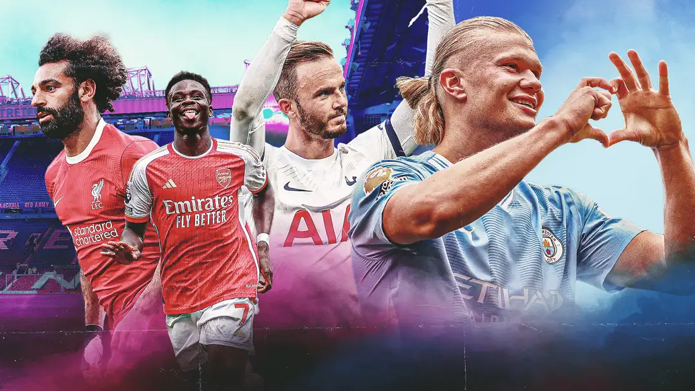

# Web Scraping and Clustering with Premier League

The Premier League is the highest level of the England football. 20 teams play each season. The seasons typically run from August to May with each team playing 38 matches (playing all other teams both home and away)

Premier League is the most-watched sports league in the world, broadcast in 212 territories to 643 million homes.

The idea of this project is using Web Scraping to collect the data, and then apply clustering in order to find similarities and differencies among the players.

The data is from the season 2022/2023. We have data related to the teams and to the players.

We have data about offensive, deffensive, passes and summary stats.

The main keys of this project are:
* Web Scraping to collect the data and a little ETL process.
* A little Exploratory Data Analysis.
* Clustering using K-means.

I uploaded the data sets generated to Kaggle: https://www.kaggle.com/datasets/alegallagher/premier-league-20222023